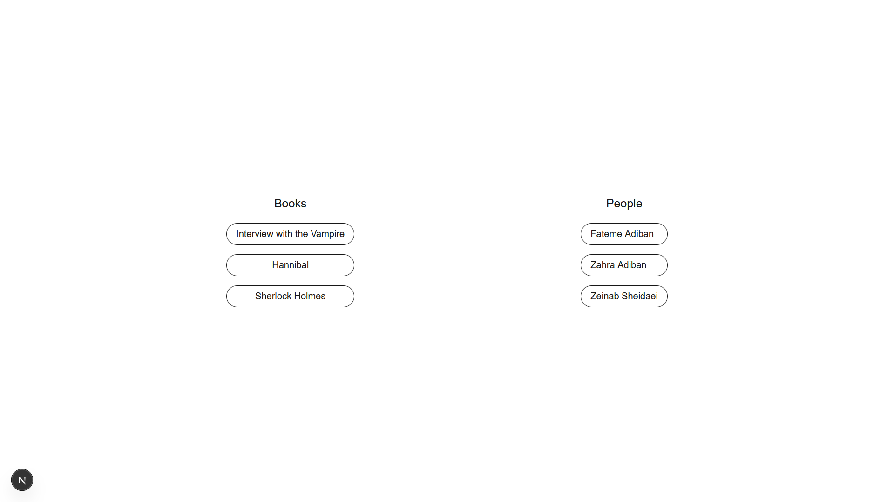

1. Install dependencies:
   npm install
2. Start the development server:
   npm run dev
3. Open http://localhost:8080

First, I created the data.json file and added an array of objects representing books.
Then, I fetched the data in a separate component called FetchData to avoid reducing performance.
Since we use useState and useEffect, this component needs to be a client component.
Finally, I fetched and rendered the data in that component.
I fetched the data from both the state and a JSON file.

