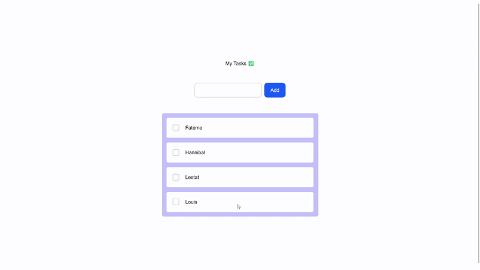

## Drag & Drop Tasks App

The tasks state is stored in **localStorage** so that changes persist even after page refresh.

---

## Install the following

```bash
npm install @dnd-kit/core @dnd-kit/utilities @dnd-kit/sortable
```

---

## Component Architecture

### DragAndDrop.tsx

- Holds the main state (`tasks`).
- Initializes state from localStorage.
- Syncs state changes to localStorage using `useEffect`.
- Handles drag & drop events.

### Column.tsx

- Container for a group of `Task` components.
- Wrapped with `SortableContext` to enable drag & drop between tasks.

### Task.tsx

- Draggable task item.

### Input.tsx

- Gets user input and adds new tasks to the state.

---

## Edge Cases

- Empty localStorage → the state falls back to the default initial values.
- Task with empty title or only spaces → adding the task is prevented.
- Dragging an item onto itself → no changes are applied.
- Page refresh → the last saved state is correctly restored.


